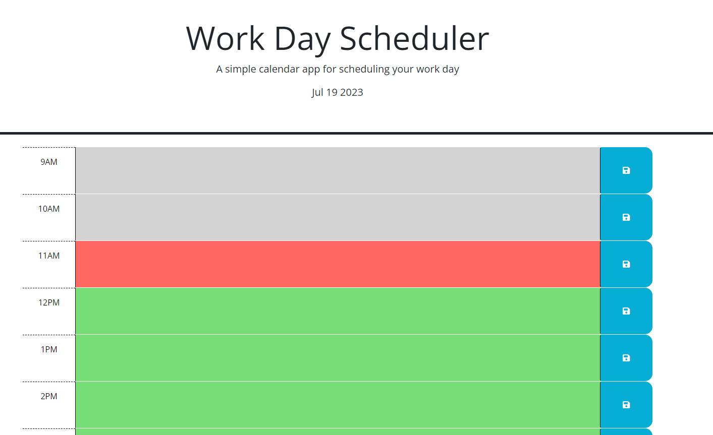

# Module-5-Challenge

## Description

The application is designed to be a work day planner. The user can enter what they want to do during the day, and the planner will change colors as the hours change so you know exactly when it's time to work. Simply click the save button and your planner is all set!

## Installation

To install, go to the deployed application link below.

https://toosparky.github.io/module-5-challenge/

## Usage

To use, all you need to do is type in what you want to do that day, save, and you have a nice planner at your disposal.

## Credits

Zach Barnes - https://github.com/TooSparky

## License

No current licenses.
